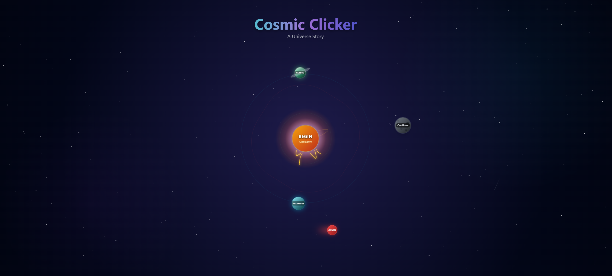
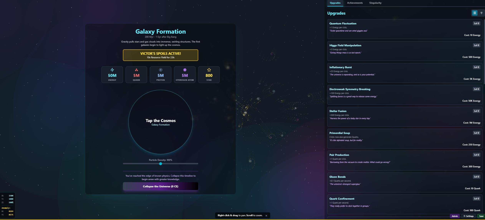

<div align="center">

  # 🌌 Cosmic Clicker v0.1
  
  **Eine Reise von der Singularität bis zum Rande des Universums.**

  [](https://reactjs.org/)
  [](https://www.typescriptlang.org/)
  [](https://tailwindcss.com/)
  [](https://vitejs.dev/)

  <p align="center">
    <a href="#-die-reise">Die Reise (Screenshots)</a> •
    <a href="#-features">Features</a> •
    <a href="#-installation">Installation</a>
  </p>

  ---
</div>

## 🔭 Über das Projekt

**Cosmic Clicker v0.1** ist mehr als nur ein Spiel – es ist eine interaktive Simulation der kosmischen Evolution. Der Spieler beginnt im absoluten Nichts und klickt sich durch Milliarden Jahre physikalischer Geschichte.

Von der Planck-Ära über die Entstehung der ersten Protonen bis hin zu gigantischen Galaxienhaufen: Jede Phase des Spiels basiert auf echten wissenschaftlichen Konzepten, visualisiert durch eine dynamische Engine.

---

## 📸 Die Reise

Hier ist ein Einblick in die verschiedenen Phasen von *Cosmic Clicker v0.1*:

### 1. Der Anfang

> **Das heliozentrische Menü:** Der Startbildschirm ist keine statische Liste, sondern ein lebendiges Sonnensystem. Planeten fungieren als Menüpunkte (Einstellungen, Spiel laden, Credits), die um die zentrale Singularität ("Begin") kreisen. Im Hintergrund sorgt eine dynamische Simulation für Atmosphäre.

### 2. Das Interface

> **Die Simulation:** Das Herzstück des Spiels. Hier sammelst du Ressourcen (Energie, Quarks, Atome) durch Klicken oder Idle-Produktion. Der Hintergrund ist ein interaktiver 3D-Raum, in dem du dich frei bewegen und hineinzoomen kannst, um Partikel, Kometen und Sterne zu beobachten.

### 3. Wissenschaft & Fortschritt

> **Lernen durch Spielen:** Wenn du eine neue kosmische Epoche erreichst, wird nicht einfach nur Text angezeigt. Das Spiel präsentiert komplexe physikalische Gesetze – wie hier die Heisenbergsche Unschärferelation oder E=mc² – mit wunderschönen, animierten Visualisierungen, die das Konzept verständlich machen.

### 4. Absolute Kontrolle

> **God Mode:** Für Entwickler und Tester gibt es ein umfangreiches Admin-Panel. Hier lassen sich Ressourcen manipulieren, zu bestimmten Epochen springen, Events (wie Supernovae oder Schwarze Löcher) manuell auslösen und versteckte Geheimnisse (wie der "Secret Star") lokalisieren.

### 5. Das Endgame

> **Galaktische Maßstäbe:** Im späten Spielverlauf ("Endgame") verwalten Spieler gigantische Strukturen. Ressourcen werden nicht mehr in Einer-Schritten, sondern in Millionen und Milliarden gemessen. Hier bereitet sich der Spieler auf die **Singularität** vor – den Prestige-Mechanismus, um das Universum zu kollabieren und mit Dunkler Materie und Kosmischer Essenz neu zu beginnen.

---

## ✨ Features

*   **🧬 Evolution der Materie:** 7 wissenschaftliche Epochen, von der Ursuppe bis zur Galaxienbildung.
*   **🎨 Living Background:** Eine eigens entwickelte HTML5 Canvas Engine rendert tausende Partikel, Nebel und Sternenfelder.
*   **🌌 Sternbild-Skilltree:** Upgrades werden nicht nur als Liste, sondern optional als verbindbares Sternbild visualisiert.
*   **☄️ Dynamische Events:** Zufällige Ereignisse wie Kometenschauer (klickbar!), Gammablitze und Quantenfluktuationen.
*   **🎹 Prozedurales Audio:** Ein Synthesizer auf Basis der Web Audio API erzeugt Soundeffekte in Echtzeit.
*   **♾️ Prestige System:** Kollabiere dein Universum, um *Kosmische Essenz* zu erhalten und mächtige dauerhafte Boni freizuschalten.

## 🚀 Installation

Um dieses Universum auf deinem lokalen Rechner zu starten:

1.  **Repository klonen**
    ```bash
    git clone https://github.com/yourusername/cosmic-clicker.git
    cd cosmic-clicker
    ```

2.  **Abhängigkeiten installieren**
    ```bash
    npm install
    ```

3.  **Entwicklungsserver starten**
    ```bash
    npm run dev
    ```

4.  Öffne deinen Browser unter `http://localhost:5173`

---

<p align="center">
  Built with 💙 and 🌟 by Lamangy and AI
</p>
